<center>

  

  <p>
    <strong>Every commit is an extraction mission.</strong>
    <br>
    A 3D top-down extraction shooter in your browser, where real git commands only run if you survive.
  </p>

</center>

## What is this?

Your staged files are cargo. You carry them across a hostile city to the extraction pad and hold it while the commit is written. Take a hit and the crate on top is knocked loose, decaying on the ground until you go back for it — or don't.

Whatever you fail to extract is unstaged instead of committed. In **extreme mode**, the stakes are worse: lost files are deleted from disk.

## Install

```bash
npm install -g git-commandos
```

Needs Node 18.17+ and a real git on your PATH. The game ships pre-built — there is
nothing to compile after install.

```bash
# or run from a clone
pnpm install && pnpm build
node cli/index.mjs --help
```

## Commands

| Command | Description |
|---|---|
| `gcmds commit -m "message"` | Commit staged files — survive to ship them |
| `gcmds push [remote] [branch]` | Push commits to remote |
| `gcmds merge <branch>` | Merge a branch |
| `gcmds quick-run` | Stage fake files and play a test round |
| `gcmds fake-files [--count=N]` | Create and stage N fake `.ts` files |
| `gcmds play` | Launch sandbox mode (no real git state) |

All commands accept `--extreme`: on loss, files are **deleted from disk** instead of just unstaged.

## Drop in `gcmds` wherever you type `git`

`gcmds` is a superset of git. Anything it does not gate, it hands to git exactly as
typed — same output, same exit code:

```bash
gcmds status
gcmds log --oneline -10
gcmds rebase -i HEAD~3
gcmds commit -m "earn it"   # ← this one opens the game
```

So you can alias it and forget about it:

```bash
alias git=gcmds   # in ~/.zshrc or ~/.bashrc
```

**`git` itself is never touched.** Nothing is installed, symlinked or shadowed on your
PATH — the alias is yours to add and remove, and every script, hook and tool on your
machine keeps calling the real `git` exactly as before.

What is gated and what is not:

- **Gated:** `commit`, `push`, `merge` — in the plain forms, the ones that mean "ship
  what I have".
- **Passed through:** everything else, and any form of those three the game has no
  business interpreting — `--amend`, `--fixup`, `-p`, a pathspec, `merge --abort`,
  `merge --continue`, `push --delete`, refspecs like `origin :old-branch`. Those go to
  git exactly as typed.
- Flags you pass along (`--no-verify`, `--signoff`, `-u`) are forwarded to the real
  command once you have survived.
- `gcmds commit` with no `-m` still opens your editor, with your template, first.
- Hooks still run. `-C`, `--git-dir` and the rest of git's global options are never
  parsed by us — an invocation carrying them is git's.

Aliased and want to skip the game once? Type `\git` (or `command git`).

## What a run looks like

Every command opens the game in your browser. The briefing is your actual commit —
message, branch, files, and what a failed run will cost you.

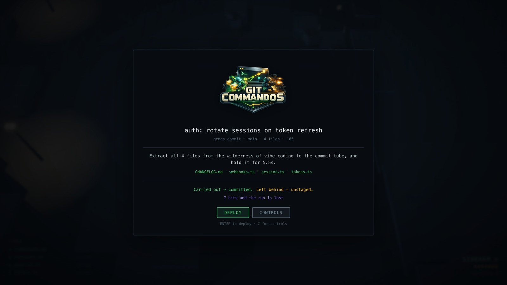

Your staged files are cargo, on your back from the moment you land. The extraction pad
is somewhere across a dark city, and the marker tells you how far.

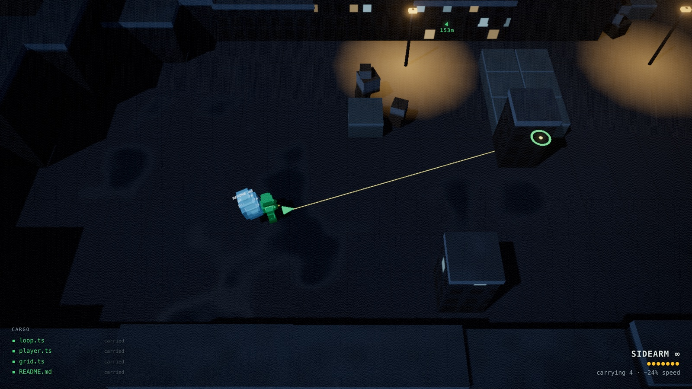

**Recruiters** hold range and talk at you while they shoot. Every hit knocks a crate
loose, and a dropped file decays on a visible timer — recover it or it's gone.

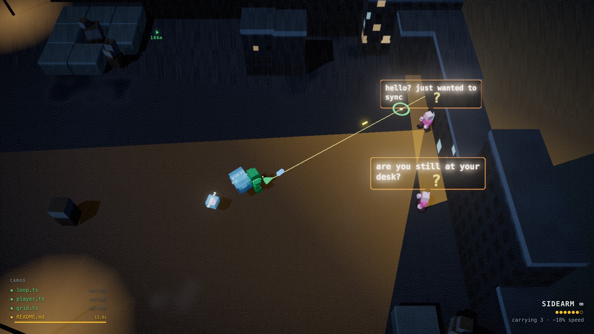

**Interns** arrive in packs. One is nothing; four at once while a recruiter holds range
is the pincer the two of them exist to create.

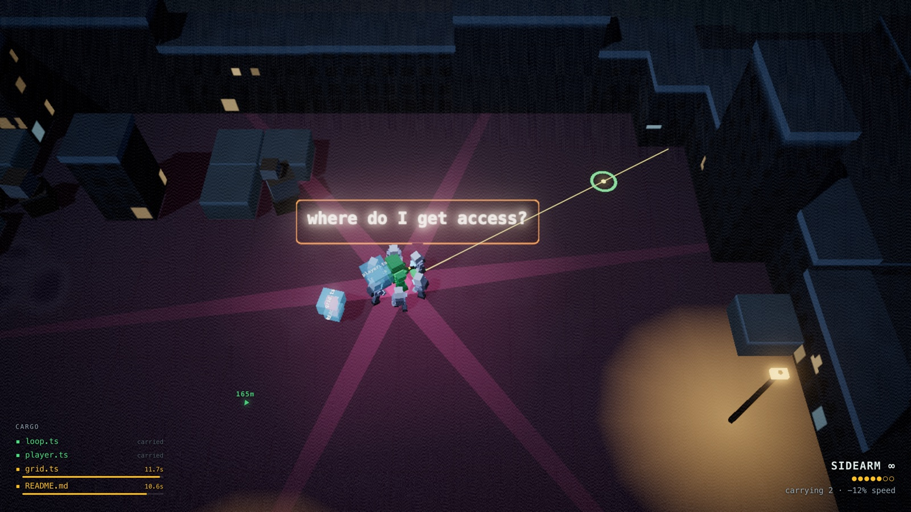

**The Organizer** glides in around a minute deep and starts putting things in your
calendar.

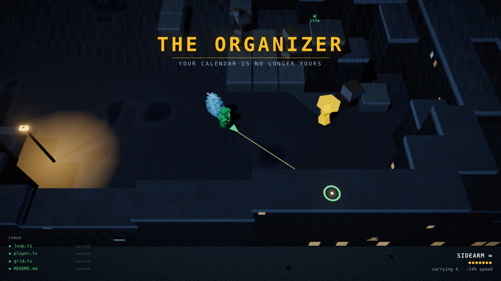

What it schedules lands on the map: amber meetings you are compelled to attend (and are
safe from fire inside), red ones that pin you in molasses if you step in.

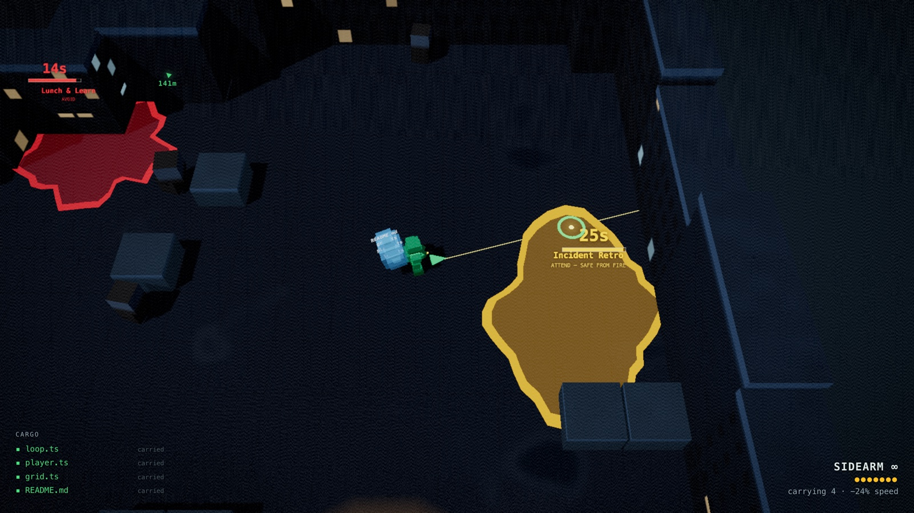

**The Outlook Invite Storm** rains invites across the block.

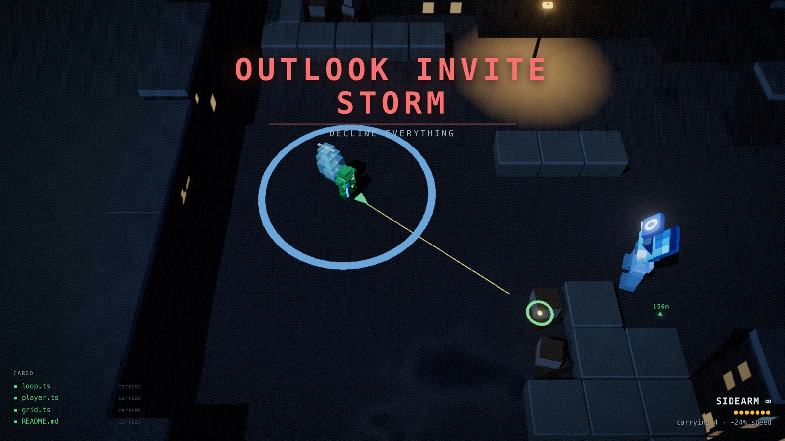

Catch one and you get a modal. It accepts itself if you don't answer.

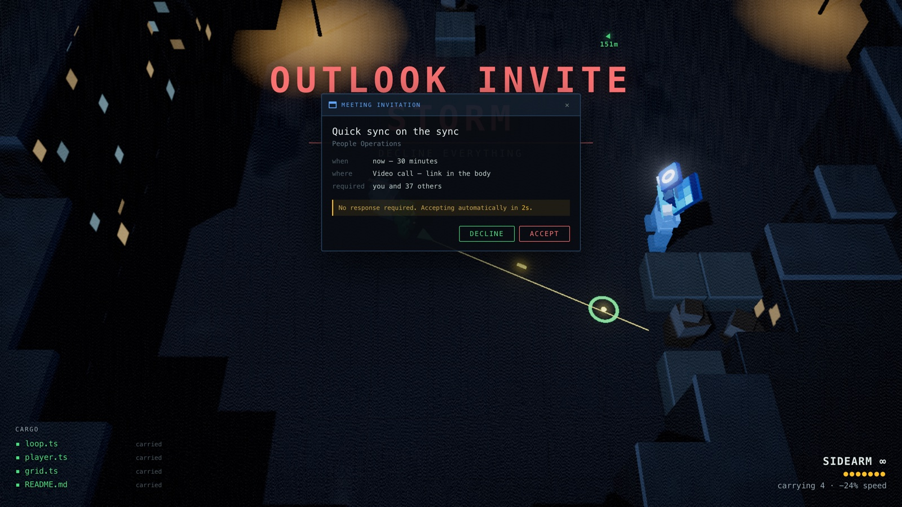

**The AI bro stampede** runs the length of the route, twice a run. Unarmed, oblivious,
and moving — get out of the lane.

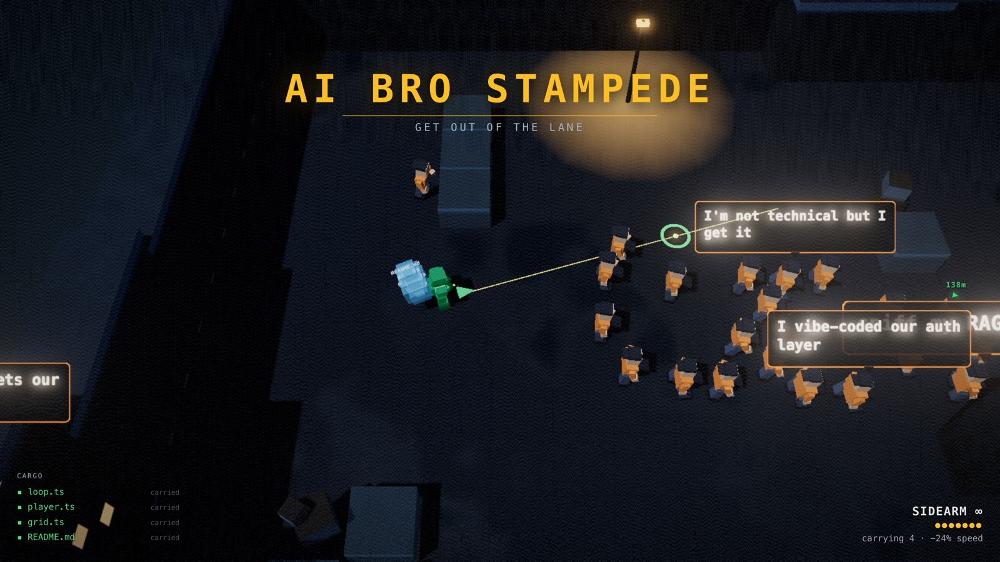

Reaching the pad isn't the end: you have to hold it while the commit is written, which
is exactly when the second stampede is scheduled.

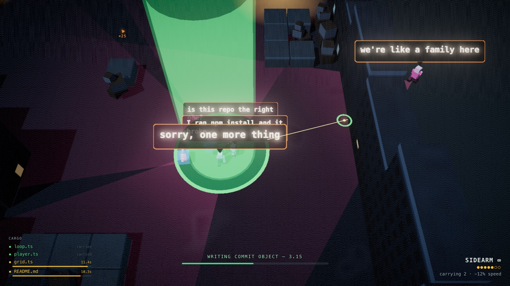

Carry it all out and the commit lands, with a footer recording how it was earned.

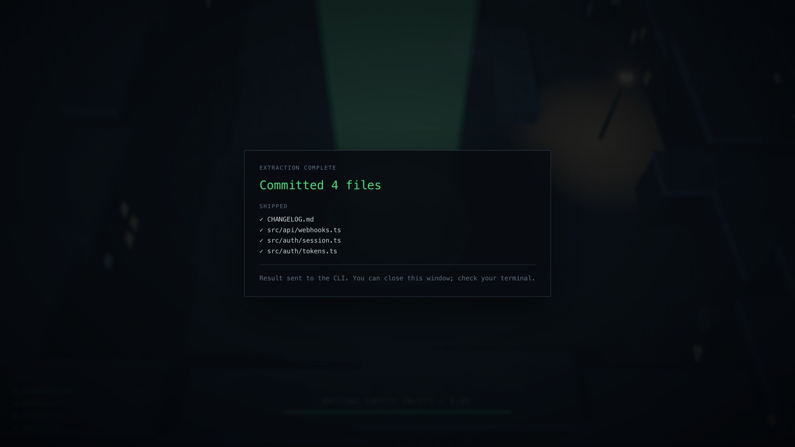

Don't, and nothing is committed — the files you lost are unstaged behind you. In
`--extreme` mode they are deleted instead.

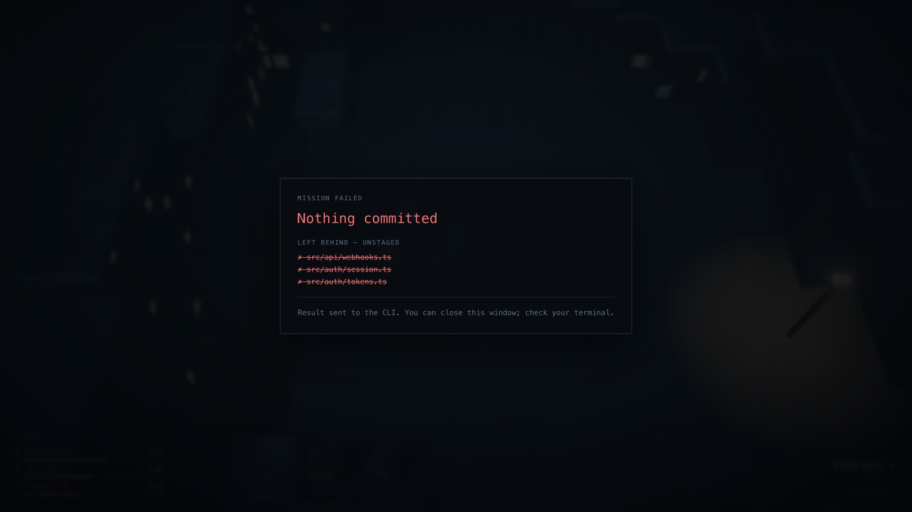

### Controls

| Input | Action |
|---|---|
| WASD | Move |
| Mouse | Aim |
| Left mouse | Fire |
| Space | Dodge |
| E | Interact — deposit or reclaim at the stash cache |
| Q | Drop a crate |
| R | Reload |
| Esc | Pause |

Gamepad works too — sticks to move and aim, triggers to fire.

### Pickups

| Pickup | Effect |
|---|---|
| Machine Gun / Shotgun | Weapon upgrade — the Sidearm never runs out, these do |
| Ammo | Rounds for the matching weapon only |
| Medkit | Heal, under the `health` rule |

## Development

```bash
pnpm install   # also copies chiptune3 worklet files to public/audio/
pnpm dev       # Vite dev server (game only, no CLI integration)
pnpm build     # build to dist/ (required for CLI commands to work)
gcmds quick-run   # fast test loop
```

Music: drop a `.xm` or `.mod` tracker file at `public/music/chiptune.xm`. Free tracks at [modarchive.org](https://modarchive.org).

---

## FAQ

**Is this a good idea?**
No.

**Is it safe to use on a real project?**
No.

**I lost a bunch of work. What do I do?**
Please fill out [this form](https://github.com/itsjobojo/git-commandos/issues/1).
