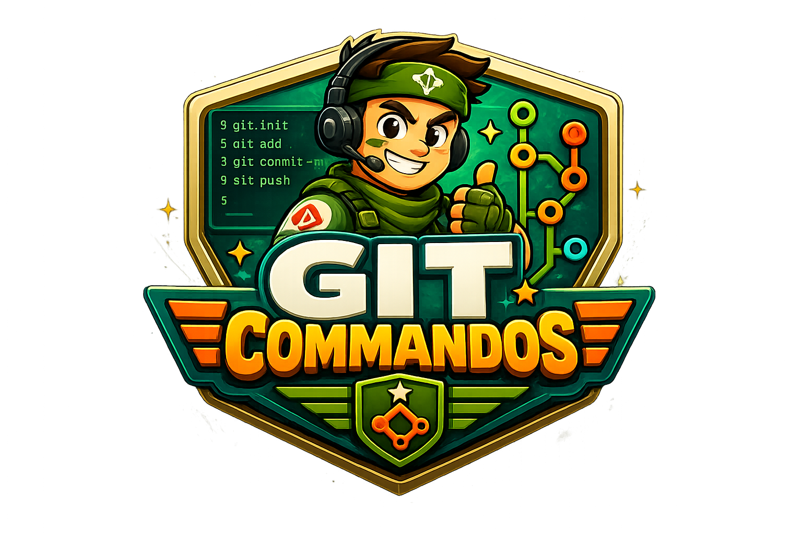

<center>

  

  <p>
    <strong>Every commit is an extraction mission.</strong>
    <br>
    A chaotic 2D action-game CLI where real git commands only run if you survive.
  </p>

</center>

## What is this?

Your staged files become your lives. Take a hit, lose a life. Run out of lives, and those files are unstaged instead of committed.

In **extreme mode**, the stakes are worse: lost files are deleted from disk.

## Install

```bash
npm install -g git-commandos
# or run locally
node cli/index.mjs --help
```

## Commands

| Command | Description |
|---|---|
| `gcmds commit -m "message"` | Commit staged files — survive to ship them |
| `gcmds push [remote] [branch]` | Push commits to remote |
| `gcmds merge <branch>` | Merge a branch |
| `gcmds quick-run` | Stage fake files and play a test round |
| `gcmds fake-files [--count=N]` | Create and stage N fake `.ts` files |
| `gcmds play` | Launch sandbox mode (no real git state) |

All commands accept `--extreme`: on loss, files are **deleted from disk** instead of just unstaged.

## How it works

Running any command opens the game in your browser. Your staged files (or commits, for push/merge) become your HP — the more files, the more lives. Lines added scale the level length. Survive to the end zone and the git operation completes. Die and nothing happens (or in extreme mode, everything is lost).

### Controls

| Key | Action |
|---|---|
| Arrow keys / WASD | Move |
| Z / Space | Shoot |
| Q | Shoot diagonal left |
| E | Shoot diagonal right |
| C | Git revert — clears screen, recovers a lost file |
| ↑ (near door) | Enter building |

### Pickups

| Pickup | Effect |
|---|---|
| SMG / Machine Gun / Shotgun | Weapon upgrade |
| Ammo | Restock current weapon |
| HP+ | Heal and recover a lost file |
| Git Revert | +1 revert charge |
| Git Stash | 3 seconds invincibility |

## Development

```bash
pnpm install   # also copies chiptune3 worklet files to public/audio/
pnpm dev       # Vite dev server (game only, no CLI integration)
pnpm build     # build to dist/ (required for CLI commands to work)
gcmds quick-run   # fast test loop
```

Music: drop a `.xm` or `.mod` tracker file at `public/music/chiptune.xm`. Free tracks at [modarchive.org](https://modarchive.org).

---

## FAQ

**Is this a good idea?**
No.

**Is it safe to use on a real project?**
No.

**I lost a bunch of work. What do I do?**
Please fill out [this form](https://github.com/itsjobojo/git-commandos/issues/1).
